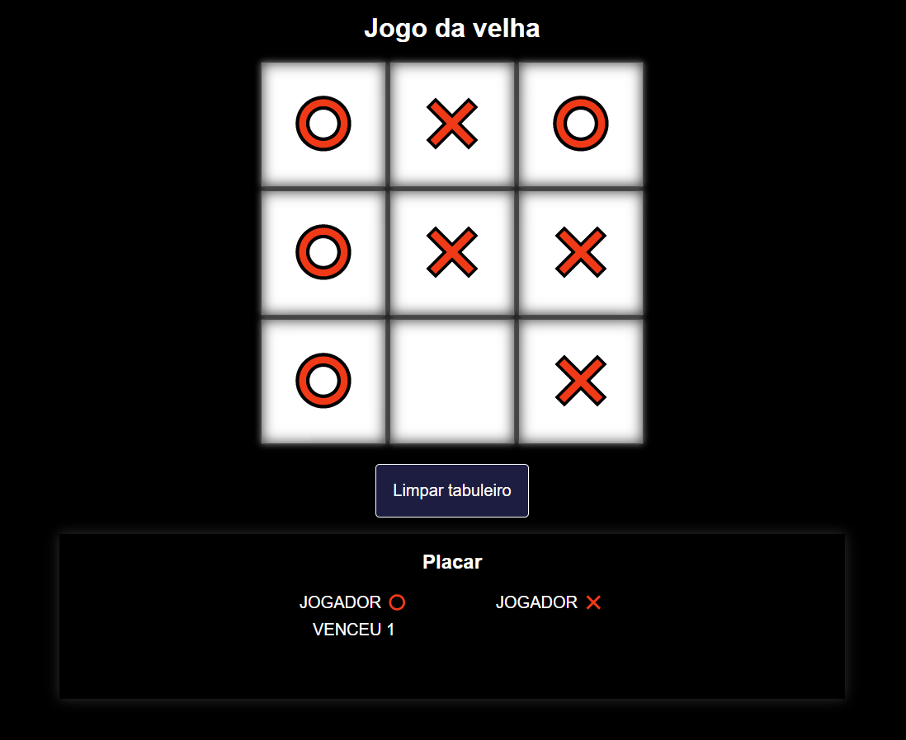

# JogoDaVelha

## Jogo da velha contra a máquina.

Exercício do curso de Javascript / Programador BR. 

Nesse exercício trabalhei com laços de repetição, condicionais e manipulação de array. 
Em cada jogada do usuário, é escolhida de forma randômica a posição da jogada da máquina, 
sempre verificando as casas que já foram ocupadas. 

Também são feitas verificações que impossibilitam o usuário de jogar em uma casa ocupada, 
ou quando for Game Over e qual jogador foi o vencedor, para marcar o placar.

## Print do Jogo

